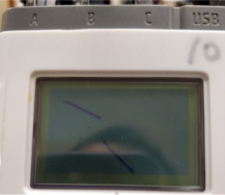
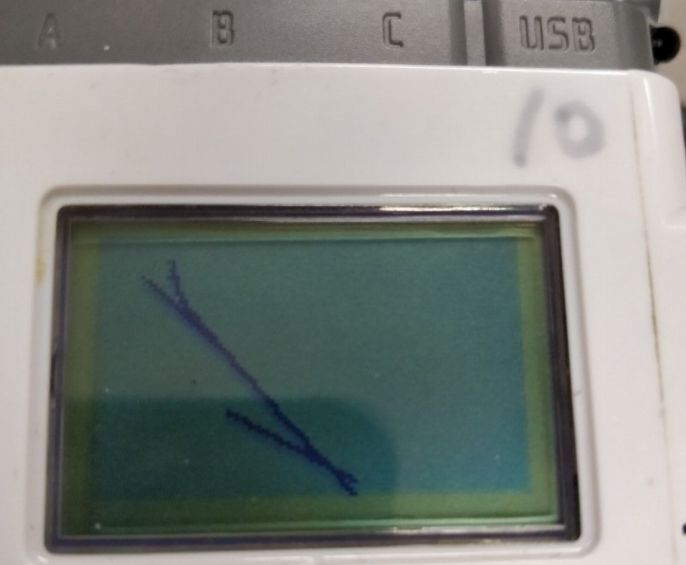

# Obstacle-Avoiding Navigating Robot
## Sarmed Alwan

# Description of Robot’s Movement and Behaviours

My robot uses the Behavior API to prioritise its different tasks, such as
moving to the objective, avoiding obstacles, searching for colour, etc. The
arbitrator for the behaviours is coded as such:

```Java

Behavior[] bArray;
bArray = new Behavior[]{new moveRobot(pilot, nav, opp), new search(pilot, nav), new
foundColour(SensorPort.S2, nav), new avoidObstacle(opp, SensorPort.S3, pilot, nav)};
Arbitrator arb = new Arbitrator(bArray);
nav.addWaypoint(150, 150);
arb.start();
```

This places the movement of the robot to the objective at the lowest
priority, as it may be interrupted at any time by the need to avoid an
obstacle or the finding of the colour red (the colour of the objective). This
means that the robot won’t just keep moving forward when it reaches the
objective or runs into the obstacle. The line ```nav.addWaypoint(150,150);```
tells the robot to move towards the objective’s location, and when the line
```arb.start();``` is executed, the arbitrator starts running the queue of
behaviours, with moveRobot actually being executed first despite having
the lowest priority, because its ```takeControl()``` method always returns true,
whilst none of the other behaviours will have had their requirements met
yet. While the behaviour isn’t suppressed by another one such as the
detection of an obstacle, the robot will move towards the objective marked
by the waypoint, and will draw the trajectory on its screen as it goes along.
This is done with the following While loop in the moveRobot() behaviour.

```Java

while(!suppressed){
 nav.followPath();
 LCD.setPixel((10+((int)opp.getPose().getX()/3)),
10+((int)opp.getPose().getY()/3),1);
};
```
The arbitrator coordinates all of the behaviours, in order of priority. The
movement behaviour is always True, but it can be overridden by the
```takeControl()``` methods in the other behaviours. The obstacle detection and
avoidance behaviour takes control with the following method:

```Java

public boolean takeControl() {
 return (sensor.getDistance() <= 20);
};
```

This gives it control whenever the sonar sensor detects something closer
than 20cm, i.e. an imminent obstacle. The ```foundColour()``` behaviour can
take control with the following method:

```Java

public boolean takeControl() {
 return (sensor.getColorID() == ColorSensor.Color.RED);
};
```

This gives it control when the colour sensor on the robot detects the colour
red, i.e. it has reached the objective. The search function takes control with
the following method:

```Java

public boolean takeControl() {
 return nav.pathCompleted();
};
```
This gives it control when the navigator has reached the objective location
(150,150), but the colour detector has not yet found the colour red. It can
then search the area for the colour red in case the robot missed it.
Below I have included images of the drawn trajectories from two runs of the
robot’s task.





The trajectories are not exactly the same, because the obstacle was not
present on the return journey of the 2nd run, but the same general shape of
the movement can be seen.

## Obstacle Avoidance Code

When the robot runs into the obstacle, the following code is executed. It
simply stops the navigation, rotates the robot around the obstacle, and
continues to draw the trajectory. Once it’s finished, the robot can then
continue on its way to the objective waypoint. The second line (commented
out) was just for testing:

```Java

nav.stop();
//System.out.println("Avoiding Obstacle");
pilot.rotate(80);
LCD.setPixel((10+((int)opp.getPose().getX()/3)), 10+((int)opp.getPose().getY()/3),1);
pilot.travel(30);
LCD.setPixel((10+((int)opp.getPose().getX()/3)), 10+((int)opp.getPose().getY()/3),1);
pilot.rotate(-80);
LCD.setPixel((10+((int)opp.getPose().getX()/3)), 10+((int)opp.getPose().getY()/3),1);
pilot.travel(30);
LCD.setPixel((10+((int)opp.getPose().getX()/3)), 10+((int)opp.getPose().getY()/3),1);
break;
```
# Conclusion

In conclusion, I believe that the project has been a success, and all
objectives have been met. I could make some extra improvements, such as
writing the trajectory to a file for further analysis, or making the robot’s
search function faster and more effective. Otherwise, the robot fulfills the
task it needs to, and I am satisfied with the result.
Appendix (Program Code)

```Java

import lejos.nxt.*;
import lejos.robotics.localization.OdometryPoseProvider;
import lejos.robotics.navigation.DifferentialPilot;
import lejos.robotics.Color;
import lejos.robotics.navigation.Navigator;
import lejos.robotics.subsumption.Arbitrator;
import lejos.robotics.subsumption.Behavior;
/**
* Created by sa16566 on 26/01/2018.
*/
public class move2 {
 public static void main(String[] args) {
 //moveThread.run(); ...........
 moveClass.run();
 }
 public static class moveClass {
 public static void run() {
 DifferentialPilot pilot = new DifferentialPilot(3.4, 21, Motor.A, Motor.C,
false);
 OdometryPoseProvider opp = new OdometryPoseProvider (pilot) ;
 Navigator nav = new Navigator(pilot, opp);
 try
 {
 Behavior[] bArray;
 bArray = new Behavior[]{new moveRobot(pilot, nav, opp), new
search(pilot, nav), new foundColour(SensorPort.S2, nav), new avoidObstacle(opp,
SensorPort.S3, pilot, nav)};
 Arbitrator arb = new Arbitrator(bArray);
 nav.addWaypoint(150, 150);
 nav.singleStep(true);
 arb.start();
 nav.stop();
 } catch (
 Exception e)
 {
 System.out.println("Exception");
 }
 }
 public static class search implements Behavior {
 private Navigator nav;
 private DifferentialPilot pilot;
 private boolean suppressed = false;
 public search(DifferentialPilot pilot, Navigator nav) {
 this.pilot = pilot;
 this.nav = nav;
 };
 @Override
 public void action() {
 pilot.setRotateSpeed(90);
 pilot.setTravelSpeed(30);
 suppressed = false;
 while(!suppressed){
 pilot.rotate(30);
 if(suppressed){break;};
 pilot.travel(10);
 if(suppressed){break;};
 pilot.travel(10);
 if(suppressed){break;};
 pilot.travel(10);
 if(suppressed){break;};
 pilot.travel(-10);
 if(suppressed){break;};
 };
 };
 @Override
 public void suppress() {
 suppressed = true;
 };
 @Override
 public boolean takeControl() {
 return nav.pathCompleted();
 };
 };
 public static class foundColour implements Behavior {
 private Navigator nav;
 private ColorSensor sensor;
 private boolean suppressed = false;
 public foundColour(SensorPort port, Navigator nav) {
 this.sensor = new ColorSensor(port);
 this.nav = nav;
 };
 @Override
 public void action() {
 suppressed = false;
 if(!suppressed){
 nav.addWaypoint(0, 0);
 nav.followPath();
 };
 };
 @Override
 public void suppress() {
 suppressed = true;
 };
 @Override
 public boolean takeControl() {
 return (sensor.getColorID() == ColorSensor.Color.RED);
 };
 };
 public static class moveRobot implements Behavior{
 private Navigator nav;
 private DifferentialPilot pilot;
 private OdometryPoseProvider opp;
 private boolean suppressed = false;
 public moveRobot(DifferentialPilot pilot, Navigator nav,
OdometryPoseProvider opp) {
 this.pilot = pilot;
 this.nav = nav;
 this.opp = opp;
 };
 @Override
 public void action() {
 suppressed = false;
 pilot.setRotateSpeed(90);
 pilot.setTravelSpeed(30);
 while(!suppressed){
 nav.followPath();
 LCD.setPixel((10+((int)opp.getPose().getX()/3)),
10+((int)opp.getPose().getY()/3),1);
 };
 /*
 if (suppressed){
 Thread.yield();
 pilot.stop();
 }
 */
 };
 @Override
 public void suppress() {
 suppressed = true;
 };
 @Override
 public boolean takeControl() {
 return true;
 };
 }
 public static class avoidObstacle implements Behavior{
 private Navigator nav;
 private DifferentialPilot pilot;
 private UltrasonicSensor sensor;
 private OdometryPoseProvider opp;
 private boolean suppressed = false;
 public avoidObstacle(OdometryPoseProvider opp, SensorPort port,
DifferentialPilot pilot, Navigator nav) {
 this.sensor = new UltrasonicSensor(port);
 this.pilot = pilot;
 this.nav = nav;
 this.opp = opp;
 };
 @Override
 public void action() {
 suppressed = false;
 while(!suppressed){
 nav.stop();
 //System.out.println("Avoiding Obstacle");
 pilot.rotate(80);
 LCD.setPixel((10+((int)opp.getPose().getX()/3)),
10+((int)opp.getPose().getY()/3),1);
 pilot.travel(30);
 LCD.setPixel((10+((int)opp.getPose().getX()/3)),
10+((int)opp.getPose().getY()/3),1);
 pilot.rotate(-80);
 LCD.setPixel((10+((int)opp.getPose().getX()/3)),
10+((int)opp.getPose().getY()/3),1);
 pilot.travel(30);
 LCD.setPixel((10+((int)opp.getPose().getX()/3)),
10+((int)opp.getPose().getY()/3),1);
 break;
 };
 };
 @Override
 public void suppress() {
 suppressed = true;
 };
 @Override
 public boolean takeControl() {
 return (sensor.getDistance() <= 20);
 };
 }
 }
}
//pilot.steer(-50, 180, true); // turn 180 degrees to the right
//pilot.steer(100); // turns with left wheel stationary
//while (pilot.isMoving()) Thread.yield();
```
